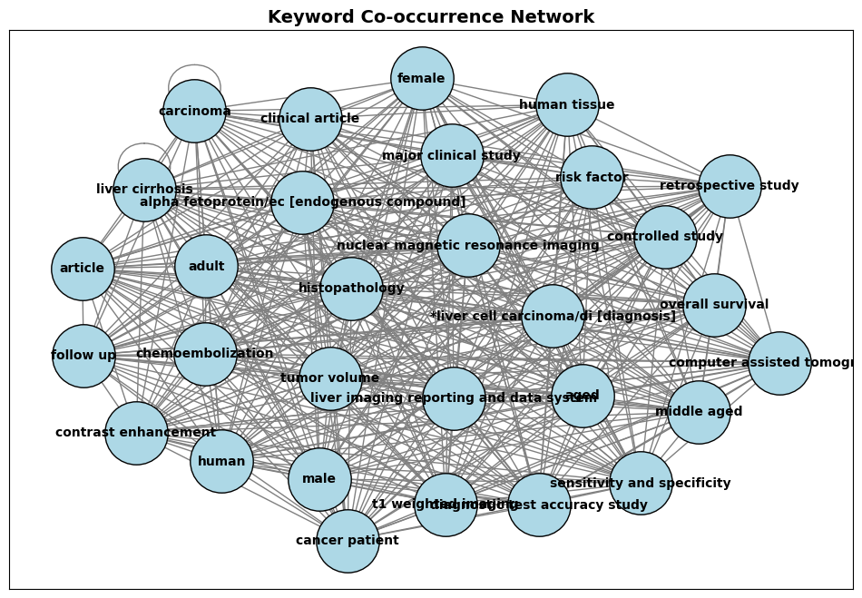

# 🧠📑 PIT Compliance Classification for Diagnostic Accuracy Papers

This project automates the classification of scientific papers based on their compliance with PIT (Population, Index test, Target condition) reporting standards for diagnostic test accuracy studies. It uses OpenAI's `gpt-4o` via LangChain and asynchronous processing to assess each study's abstract and classify it as **Qualified** or **Not Qualified**, with detailed reasoning.

---

## 🚀 Features

- 📄 Parses `.ris` citation files exported from DistillerSR
- 🧪 Extracts and cleans abstracts for NLP processing
- 🤖 Uses **GPT-4o** with LangChain to assess:
  - Population clarity
  - Index test definition
  - Target condition specification
- 🧠 Returns structured `Pydantic` outputs for each paper
- ⚡ Fully asynchronous batch processing (tqdm + asyncio)
- 📊 Saves results as Excel for further analysis
- 🌐 Builds a keyword co-occurrence **graph network** using NetworkX
- 📈 Visualizes the top 30 keywords using a spring layout

---

## 📂 Input Data

- `Abstract_Inclusions.ris`
- `Abstract_Exclusions.ris`

---

## 🔧 Setup

Install dependencies:

```bash
pip install -r requirements.txt
```

Set your OpenAI API key in a `.env` file:

```
OPENAI_API_KEY=your_key_here
```

---

## ⚙️ Workflow Overview

1. **Load RIS Files** with `rispy`
2. **Clean and Deduplicate** abstracts
3. **Combine** inclusion and exclusion papers with labels
4. **Define PIT Compliance Criteria** using a `Pydantic` model and structured prompt
5. **Invoke GPT-4o asynchronously** using LangChain + `asyncio`
6. **Store results** as a structured DataFrame and export to Excel
7. **Build a keyword network** from the top 30 co-occurring keywords
8. **Visualize** the graph using `matplotlib`

---

## 🔍 Sample Output Columns

- Population (boolean)
- Population Reason
- Index Test
- Index Test Reason
- Target Condition
- Target Condition Reason
- Qualification
- Qualification Reason

---

## 📈 Visualization

- Co-occurrence network of top keywords using NetworkX
- Optional interactive version (commented out) via PyVis

---

## 📌 Notes

- This script assumes abstracts and titles are informative enough for classification.
- Modify batch size or model version (`gpt-4o`) as needed.
- Extend the parser for full-text analysis or add external validation metrics.

---

## 📊 Example Graph Output



---

## 👨‍🔬 Author

**Pouria Mortezaagha**  
_Data Analyst | AI Researcher | Full Stack Developer_  
📎 [LinkedIn](https://www.linkedin.com/in/pouria-mortezaagha/)

---

## 📄 License

This project is licensed under the MIT License.
